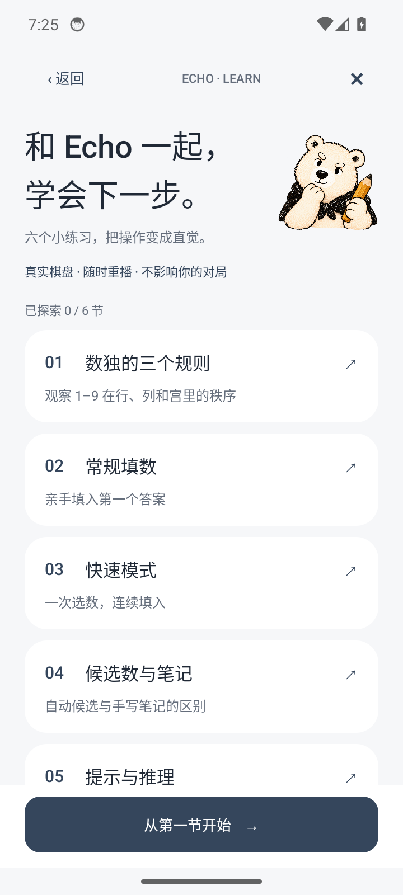
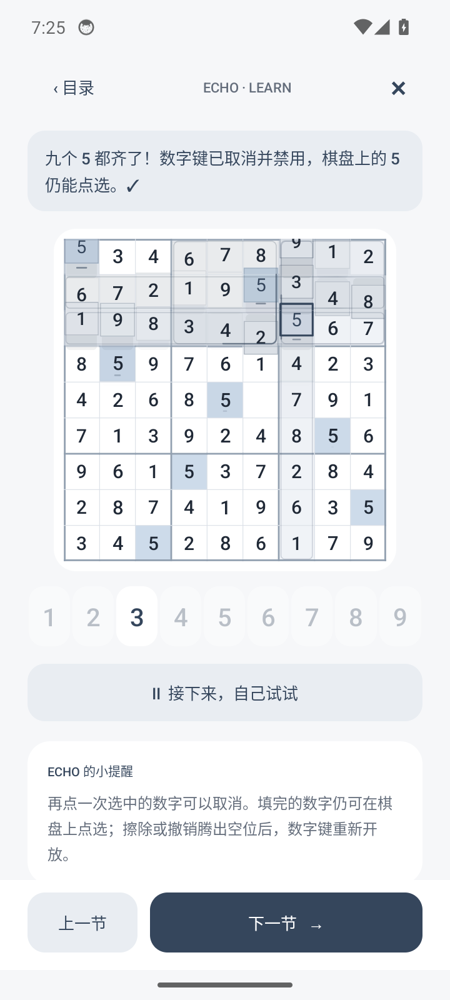
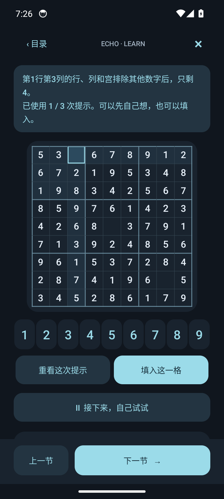

# EchoSudoku

**和 Echo 一起，把下一格想明白。**

一款原生 Android 离线数独游戏。简约界面、蜡笔白熊、轻柔的格子波浪，以及一点值得收藏的光。

[下载 APK](https://github.com/tankecho42/EchoSodu/releases/latest) · [玩法与架构](docs/architecture.md) · [反馈问题](https://github.com/tankecho42/EchoSodu/issues)

<p>
  
  
  
</p>

## 玩得轻一点

- 四档难度，三错挑战 / 不限错练习；每日一题和断点续玩。
- 常规填数与快速模式，同数高亮、候选数、笔记、撤销、擦除和有推理解释的三次提示。
- 完成行、列、宫或同一数字时，格子各自形成波浪；通关后整盘起伏和全屏庆祝。
- 五套主题：简约白、深色、浅蓝、浅红、原野绿；可关闭动效和触感。
- 独立统计、打卡热力图、难度纪录与十六枚分级 Echo 奖章。
- 六节原生互动教学：可重播演示，也能亲手操作真实棋盘；学习不影响当前局和成绩。
- 无账号、无广告，核心玩法与教学完全离线。存档可手动导入、导出。

## 名称与兼容性

产品名称已统一为 **EchoSudoku**（数独的标准英文是 Sudoku）。原 GitHub 仓库地址继续有效，旧版本历史记录保持原名。应用 ID、签名、偏好存储和备份文件内部标识不变，旧存档仍可导入；旧设备测试环境变量也继续兼容。

## 安装

从 [Releases](https://github.com/tankecho42/EchoSodu/releases) 下载 `EchoSudoku-1.10.1.apk`。支持 Android 8.0 及以上。

官方发布版使用同一签名，可覆盖更新并保留本机进度。卸载会删除本机数据，更换设备前请在设置中导出存档。

## 构建

应用使用原生 Java / Android View / Canvas，无第三方运行时依赖。

### Android Studio / Gradle

用 Android Studio 打开 `android/`，配置 JDK 17 和 Android SDK 34。或在终端执行：

```sh
cd android
./gradlew assembleDebug
```

调试包输出到 `android/app/build/outputs/apk/debug/`。

### 已安装 SDK 的直接构建

需要 JDK 17、Android SDK Platform 34、Build Tools 35.0.0 和 Python 3：

```sh
export JAVA_HOME=/path/to/jdk-17
export ANDROID_HOME=/path/to/android-sdk
python3 tools/build_apk.py
```

脚本使用本地官方 SDK 工具编译、对齐和签名，输出到 `artifacts/v1.10.1/`。首次运行在本机生成独立签名，私钥不会写入项目；自行构建的签名与官方版不同。

### 检查

```sh
python3 tools/test_core.py
# 使用专门的测试模拟器：设备测试会操作该模拟器里的测试数据
ECHOSUDOKU_ADB_SERIAL=emulator-5556 python3 tools/run_device_tests.py --build-only
adb -s emulator-5556 shell am instrument -w \
  com.tankecho.zensudoku.tests/.TutorialDeviceTests
```

教学测试覆盖真实按钮交互、候选与笔记、提示计次、快速模式、后台停止、活动恢复，以及真实存档和计时隔离。测试代码单独打包，不进入发布 APK。

## 项目结构

```text
android/app/src/main/
  java/com/tankecho/zensudoku/   游戏逻辑、原生页面和动画
  assets/                      分级题库
  res/                         Echo 插画、图标和主题资源
tools/                         构建、题库与回归测试
docs/                          架构、素材说明和真实界面截图
```

作者：**Tank** · 项目：[EchoSudoku 源码](https://github.com/tankecho42/EchoSodu)

Echo 插画由 ImageGen 生成，界面、棋盘、徽章结构与光效由原生代码绘制。详见 [素材说明](docs/assets.md)。
